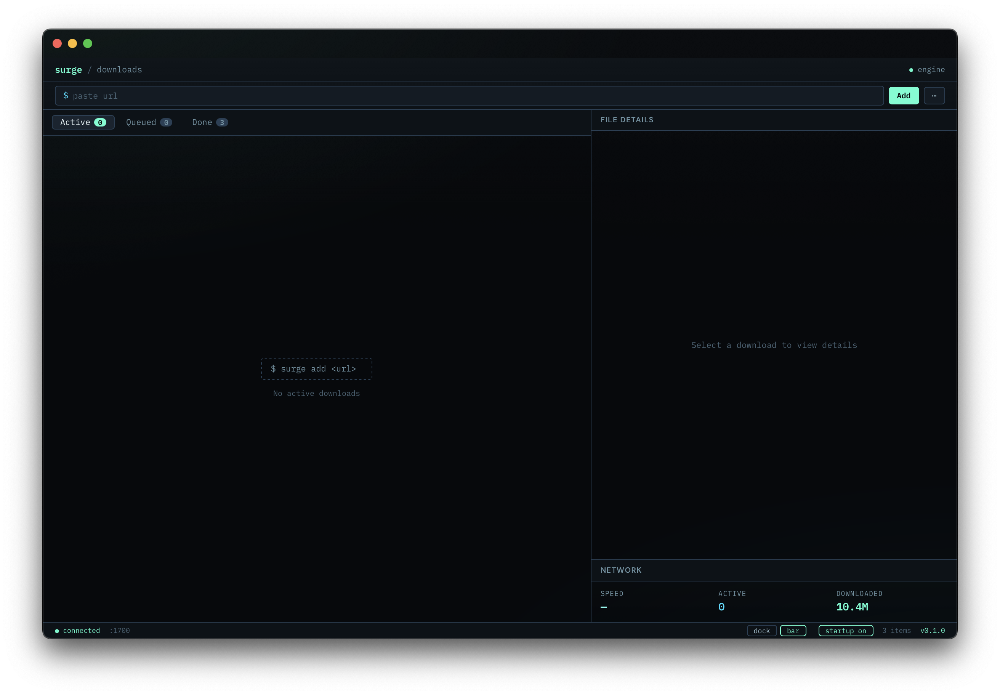

# Surge Desktop

A fast, minimal download manager built with [Wails](https://wails.io/) + Svelte + Go.




## Features

- **Download management** — add URLs, pause, resume, delete downloads
- **Real-time progress** — SSE event streaming with live speed & ETA
- **Launch at Login** — toggle auto-start via macOS LaunchAgent
- **Dock / Menu Bar mode** — choose where the app icon lives
- **Single instance** — opening the app twice just focuses the existing window
- **Dark UI** — obsidian-themed interface

## Quick Start

### Prerequisites

- [Go 1.21+](https://go.dev/)
- [Node.js 18+](https://nodejs.org/)
- [Wails CLI v2](https://wails.io/docs/gettingstarted/installation)
- [Surge CLI](https://github.com/nicholasgasior/surge) running as backend server

### Development

```bash
wails dev
```

Opens the app with hot-reload for frontend changes.

### Build

```bash
wails build
```

Produces `build/bin/Surge.app` (macOS).

## Project Structure

```
surge-wails/
├── app.go                  # Backend: download API, SSE, autostart, icon mode
├── main.go                 # Wails app entry point & config
├── icon_mode_darwin.go     # macOS native: dock ↔ menu bar switching
├── icon_mode_stub.go       # Non-macOS stub
├── frontend/
│   ├── src/
│   │   ├── App.svelte      # Main UI component
│   │   ├── style.css       # Global styles
│   │   └── main.ts         # Svelte entry
│   └── wailsjs/            # Auto-generated Go bindings
├── build/
│   ├── appicon.png         # App icon source
│   └── darwin/             # macOS plist templates
└── wails.json              # Wails project config
```

## Usage

1. Start the Surge backend server (`surge server`)
2. Launch the app — it auto-detects the running server
3. Paste a URL in the top bar and hit Enter to download
4. Use the footer toggles for **startup** and **dock/bar** mode

## License

MIT
